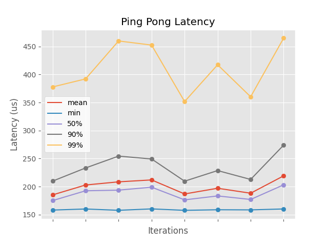
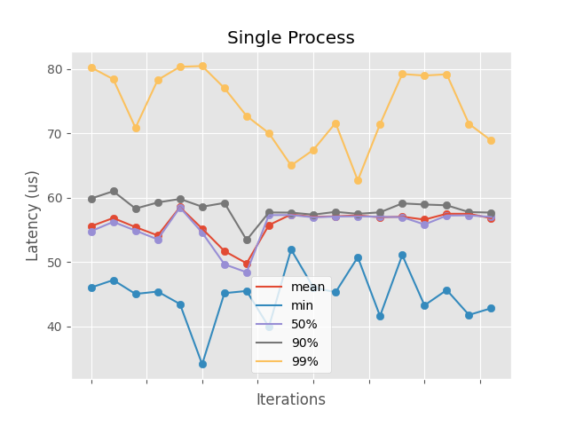

## Motivation

ROS2 is utilized by many real time systems. In these types of systems, being able to establish a reliable upper bound for latency is of upmost importance, as the correct functioning of these systems often rely on real time demands.

ROS2 adopts the DDS standard as its underlying communication system. Multiple sources have indicated that the implementation of the DDS middleware can have major effects on the end-to-end latency of a ROS2 system. For example:

* From [1]: "The DDS middleware heavily affects the transmission delay between ROS components, as all communication must pass through it" and "Future work illuminating the
effects of thread scheduling on DDS latency might enable
ROS-Llama to automatically select suitable DDS QoS options
and to predict and account for worst-case propagation delays".
* From [2]: "Our findings indicate that end-to-end latency strongly depends on the used DDS middleware" and "DDS middleware and the delay between message notification and message retrieval by ROS2 contribute the biggest portions to the overall latency".

Thus, if we are looking to improve end-to-end latency in ROS2, improving the latency of the DDS middleware is a good place to start.

This project is specifically focused on analyzing and improving the latency of Eclipse's CycloneDDS implementation. However, we hope that the findings of this project can be generalized to any DDS implementation (such as OpenDDS).

From CycloneDDS' home page, we can see the following graph:

Yellow is the max latency observed in one of the samples, and green is the median latency. The gap between the yellow line and the green line on the maximized graph is the difference that we are concerned about. We aim to minimize this difference, or at least make the yellow line more predictable. 

## CycloneDDS Benchmarking Setup

The first step was to understand how we can benchmark and obtain insightful data for CycloneDDS.

All testing and benchmarking was done on a Raspberry Pi 4B with kernel `5.10.17-v7 #1 SMP PREEMPT armv7l GNU/Linux`.

CycloneDDS is packaged with a benchmarking tool called `ddsperf`. `ddsperf` can do various different types of benchmarking, including throughput and latency tests for varying payload sizes. Our focus is placed on latency testing.

The latency tests involves creating two processes, a `ping` process and a `pong` process. The `ping` process sends a message to the DDS network, and the `pong` message will receive it and reply back. This can be used to test roundtrip latency. The following command: `sudo taskset -c 0 chrt -f 80 ddsperf pong > /dev/null & sudo taskset -c 1 chrt -f 80 ddsperf ping size {PAYLOAD_SIZE}` will create a pong and a ping process, pin them to CPUs 0 and 1, and set their priority to 80. The `pong` process is ran in the background, with its output redirected to `dev/null`. The latency test will send as many messages as possible in one second (usually around 2k), and record the min, max, mean, median, and 50th/90th/99th percentiles for latency. Running the test for 10 seconds generates 10 of these collections of statistics, which can then be plotted. 

We created multiple Python scripts to automate the benchmarking process. The most important one is `run_latency_test.py`, that will run a latency test, write the output to a file, and then optionally generate a plot of the data.

This is a plot of the output of a basic latency test:

## Potential findings 

### QoS Options
The DDS standard provides applications policies called QoS to control a wide set of non-functional properties, such as data availability, data delivery, data timeliness and resource usage. CycloneDDS supports the majority of the QoS options determined by the standard. The full list can be found [here](https://github.com/eclipse-cyclonedds/cyclonedds/blob/master/docs/manual/options.md). 

There are two QoS options that produce interesting results regarding latency: `MaxMessageSize` and `FragmentSize`. A detailed explanation of these parameters can be found [here](https://github.com/eclipse-cyclonedds/cyclonedds/blob/master/docs/manual/config.rst#controlling-fragmentation). To sum up, these parameters control the maximum size of DDS samples. Samples larger than the determined size will have to be fragmented. Fragmentation can happen at the CycloneDDS level, or at the network stack level, assuming CycloneDDS is using the network stack (more on this [in this section](#communication-interface)). 

Fragmentation turns out to be relevant to latency. Experiments from [2] show that "With a payload higher than the fragmentation size of UDP (here, 64 KB),latency increases with the payload size". Therefore we can conjecture that fragmentation of data samples is a major contributor to latency.

#### What are the next steps? What can we improve?
* Tuning `MaxMessageSize` and `FragmentSize` to the needs of each individual system is a good way to reduce latency.
* A detailed analysis of the sources of latency for CycloneDDS could provide an answer to the conjecture that fragmentation is a major contributor to latency. From [2], it is clear that latency rapidly deteriorates with sample sizes greater than the fragmentation size of UDP. However, is this additional latency introduced due to fragmentation? OR something else?
  * If so, why is fragmentation introducing such greater latency? 
  * [2] suggests the following: "we also clarify a need of alternative API for large message to manage divided packets. This is critical to handle large message. Abstraction of this will shorten DDS end-to-end latencies". This hints to the idea that reducing latency due to fragmentation could require a reworking/addition to an API, which would not be a simple task. What API does this fall into? The RMW, ROS, or the DDS standard?
* We can continue looking into QoS options, and identify more parameters that may have an impact on latency.
  * The `Reliability` QoS, that has options of `best_effort` and `reliable` has impacts on overall performance. More benchmarking could be done to quantify exactly how much.
  * Determining the best values for QoS options is highly dependent on the system the program is running on. I believe the scope of this project should be limited to identifying which QoS options are relevant, and leaving the fine tuning to the actual users of CycloneDDS.

### Communication Interface
Certainly, the inter-process communication interface that CycloneDDS uses to transmit its messages has a major impact on latency. A hierarchy of IPC interfaces from best to worst can be established as follows:
1. Intra-process communication, such as direct function calls
2. Shared Memory
3. Network Stack through Loopback interface
4. Network Stack 

`ddsperf` has the ability to run the latency test in a single process (instead of a `ping` and `pong` process). The latency improvements are dramatic:

The 99th percentile latency is reduced from ~450-500us to 50-100us. However, the use cases for a single process DDS program are very limited. 

The next best alternative is shared memory between processes. CycloneDDS claims that shared memory support is on the roadmap for an upcoming release. [We asked the Eclipse developers about a possible ETA but received no response so far](https://github.com/eclipse-cyclonedds/cyclonedds/issues/211). If CycloneDDS does not support shared memory natively, there is still an alternative. [Eclipse Iceoryx](https://github.com/eclipse-iceoryx/iceoryx) is a project (also by Eclipse) that promises true zero copy inter process communication. [Here](https://iceoryx.io/v1.0.1/) we can find some more information about setting up Iceoryx, and [here](https://osrf.github.io/TSC-RMW-Reports/humble/eclipse-cyclonedds-report.html) we can find an analysis of CycloneDDS with Iceoryx.

When single process mode is not enabled, and shared memory is not enabled through Iceoryx, CycloneDDS will default to using the loopback network interface. Wireshark can be used to analyze the packets being sent. Using loopback is not ideal, since the network stack introduces latency (such as due to fragmentation, as discussed [in this section](#qos-options)).

Finally, if we are dealing with multiple processes over the network, CycloneDDS will default to UDP, and attempt to enable multicast. For this project we are focused on performance in a single computer with a shared memory architecture, so we are not concerned with performance over the network. 

#### What are the next steps? What can we improve?
* The communication interface used by CycloneDDS is by far the most impactful setting when it comes to performance. Any possible optimization will be overshadowed by the performance improvements of using a better communication interface.
* Using single process mode when possible will always be the best alternative
* Using shared memory through Iceoryx will always be the second best alternative, at least until CycloneDDS supports shared memory natively. 
* An understanding of the loopback interface for a specific system can be very helpful in tuning the QoS options of CycloneDDS for best performance, especially the `MaxMessageSize` and `FragmentSize` options.

### System Calls

To get a big picture of the behavior of CycloneDDS with the system, we decided to analyze the system calls that `ddsperf` performs during a standard latency test. We ran `ddsperf` under `strace` with the `-c` and `-f` flags set. The `-f` flag,  will cause `strace` to attach and trace child processes. The `-c` argument causes `strace` to print out a summary of all syscalls, and the percentage of time spent in each of them. Here are the most relevant syscalls in terms of time spent:

|                 | Time Spent (%) |
|-----------------|----------------|
| `futex`           | 54.27%         |
| `wait4`           | 17.89%         |
| `_newselect`      | 9.63%          |
| `rt_sigtimedwait` | 8.10%          |

Interestingly, a very large amount of time is spent in `futex` and `wait4` calls. One of the uses of the `futex` syscall is to sleep until a lock can be acquired. This suggests that there is some potential for improvement regarding synchronization in CycloneDDS. Furthermore, increasing the payload size for the benchmark did not yield different results, which means that this inefficiency is constant. It is important to note that `strace` destroys the timing of the program by introducing extra overhead, so these values are not 100% accurate. However, that doesn't change the fact that an inordinate amount of time is spent in the `futex` syscall. 

#### What are the next steps? What can we improve?
* There are potentially large improvements regarding synchronization in CycloneDDS
* CycloneDDS could very likely benefit by identifying locks with high contention and increasing lock granularity.
* We conjecture that CycloneDDS is using futex locks for all of its locks, and that some locks should be converted to spin locks. Spin locks avoid putting the waiting thread to sleep, and instead spin indefinitely until the lock can be acquired. Spin locks can be implemented completely in userspace, and do not require two context switches like futexes do (one to put the waiting thread to sleep and one to wake up the thread again). 
* Our next step could be to analyze CycloneDDS during runtime and determine how many locks are created, if they are all futexes, and which ones have the highest contention.
  * We believe that CycloneDDS uses one singular function across its codebase to lock any lock, and another to unlock any lock. This is excellent, because we can place simple non-invasive log messages in these functions, and obtain every single lock operation. From there, we can identify locks that could be converted to spin locks (locks that are held for very short times are good candidates for this).
  * Another avenue for improvement is to determine the locks with the highest contention, and improving granularity for these locks. This requires a higher understanding of the CycloneDDS codebase than the previous approach.

## Sources
1. Blass, Tobias, et al. "Automatic Latency Management for ROS 2: Benefits, Challenges, and Open Problems." 2021 IEEE 27th Real-Time and Embedded Technology and Applications Symposium (RTAS). IEEE, 2021.
2. Kronauer, Tobias, et al. "Latency Analysis of ROS2 Multi-Node Systems." 2021 IEEE International Conference on Multisensor Fusion and Integration for Intelligent Systems (MFI). IEEE, 2021.
3. Maruyama, Yuya, Shinpei Kato, and Takuya Azumi. "Exploring the performance of ROS2." Proceedings of the 13th International Conference on Embedded Software. 2016.